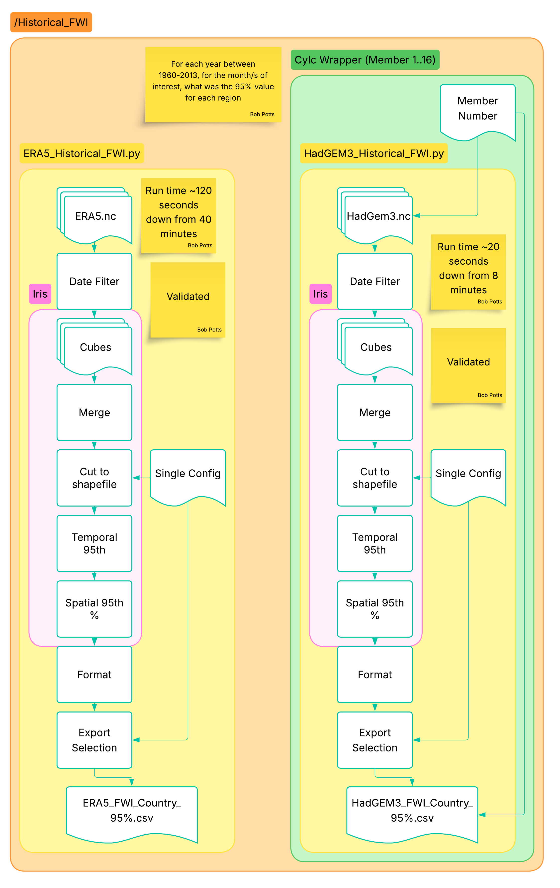
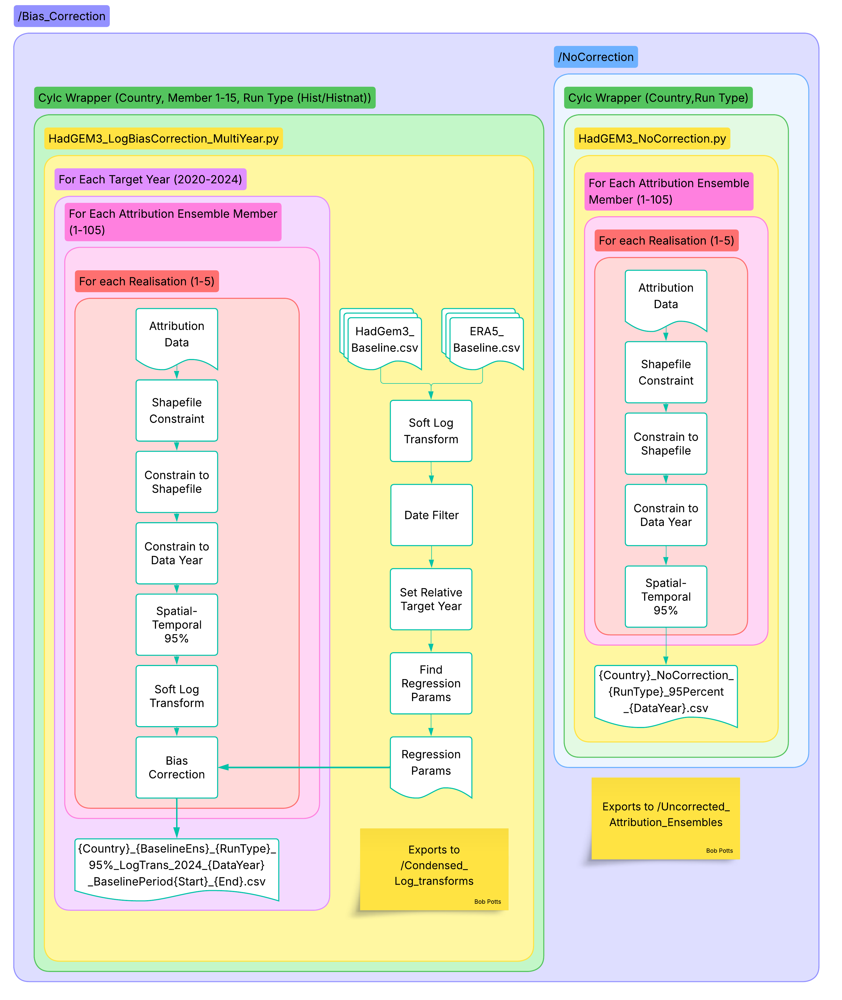

# SoW
State of Wildfires attribution code

This codebase is designed to perform Event Attribution against ERA5 observations of the Fire Weather Index (FWI) using HadGEM3-A and Historical Attribution Ensemble data to determine relative risk ratios for events observed in our warmed climate against a preindustrial climate. This codebase can be broken down into X sections and clusters of analysis as detailed below.

# Highlevel overview of intention

# Historical Baseline Establishment

Blurb
1960-2013 (variable)
(regions)

# Bias Correction of data

## Attribution Ensembles

# Risk Ratios

# Displaying Results

# Curios